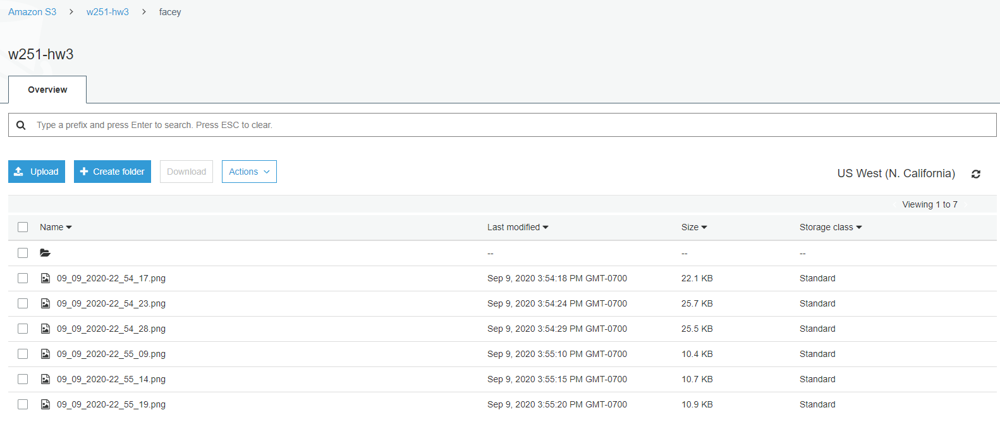
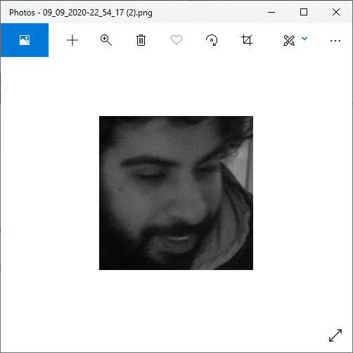

# Mumin Khan - W251 Homework 3

## Overview
This directory contains an application called `Facey`, only because I thought of the name `many-faced-god` (Game of Thrones) after submission. Facey is a simple IoT app that will creepily watch you through a webcam and send your face to Jeff Bezos on AWS. 

## Running Instructions

### Server
1. Spin up a Linux ec2 instance
2. Clone this repo 
3. cd to `week03/hw/src/server`
4. Run `docker-compose up --build`

### Client
1. Buy a Jetson Xavier NX
2. Clone this repo
3. cd to `week03/hw/src/client`
4. Modify the MQTT environment variables to match your server in `docker-compose.yml` 
5. Run `docker-compose up --build`

## Homework Information

### Notes
* This submission modifies the suggested architechture and uses a single AWS-hosted broker. 
* The topic used is called `facey`, after the application itself
* I chose to use an MQTT QoS of 1 so that collected faces are guaranteed to be delivered. I do not care that it might be more than once potentially. 

### S3 Bucket Contents

